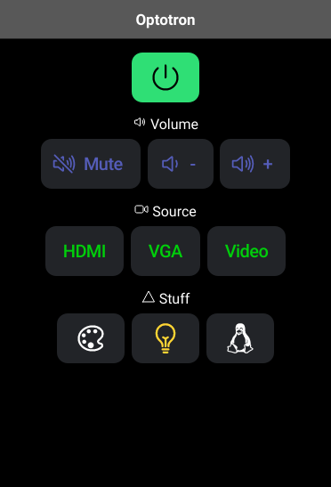

# Optotron
Control your Optoma projector via serial port (RS232)

```
                                                  ____ 
.------------.          .---------------.        |====|
|            |          | Serial to USB |        |    |
| Projector  |--RS232-->| Adapter       |--USB-->|    |
'------------'          '---------------'        |____|

```

## Getting started

```bash
$ export DEVICE=/dev/serial/by-id/usb-1a86_USB2.0-Ser_-if00-port0  # device name might differ
$ python3
>>> import optotron
>>> optotron.is_power_on()
False
>>> optotron.power_on()
>>> optotron.is_power_on()
True
```

### Implemented functions
* is_power_on
* power_on
* power_off
* mute
* unmute
* set_volume
* inc_volume
* dec_volume
* set_background_color
* get_lamp_hours
* set_input_source

[Manufacturer documentation](https://www.audiogeneral.com/Optoma/w501_rs232.pdf)

## Remote replacement

Now you can build a mobile app to control the projector, like this:


